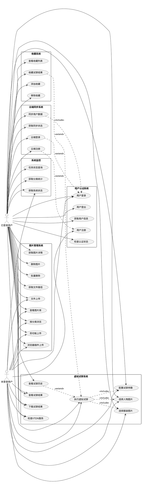
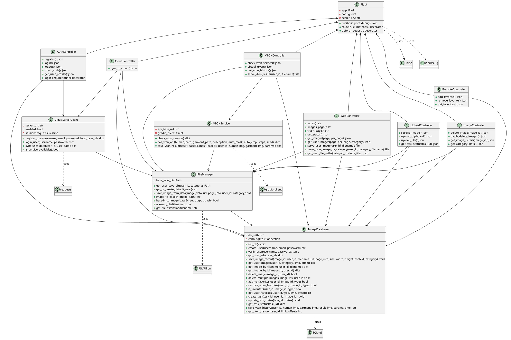
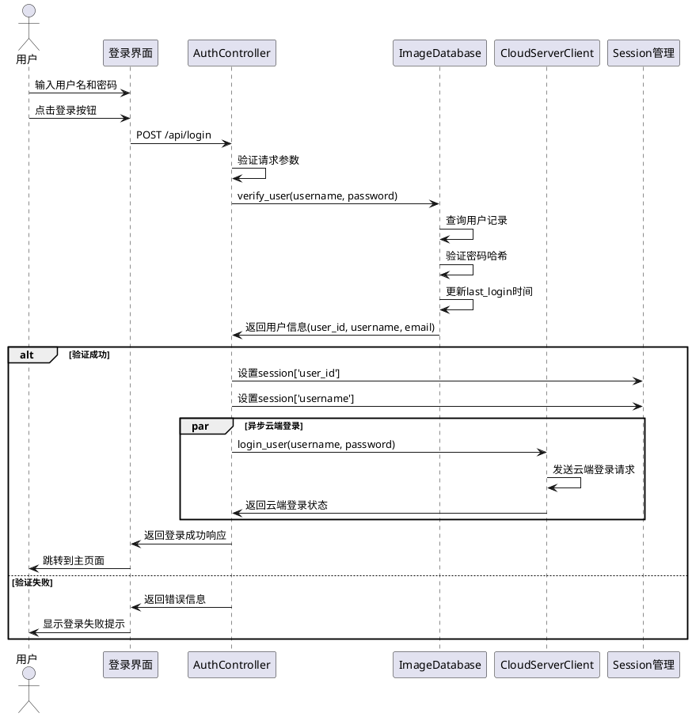
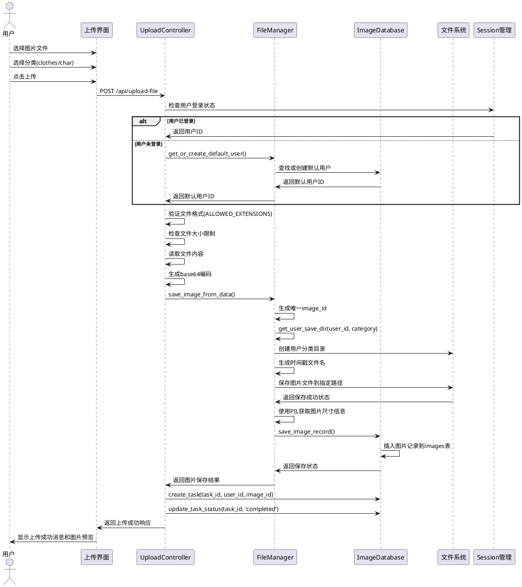
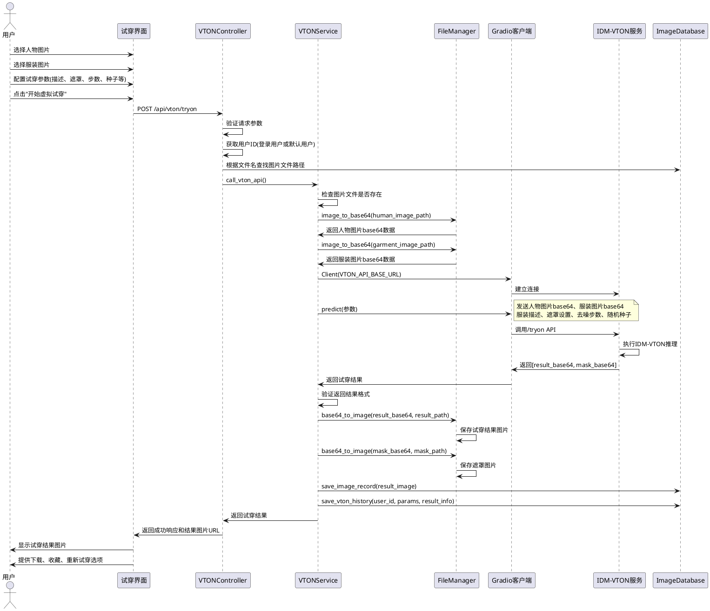
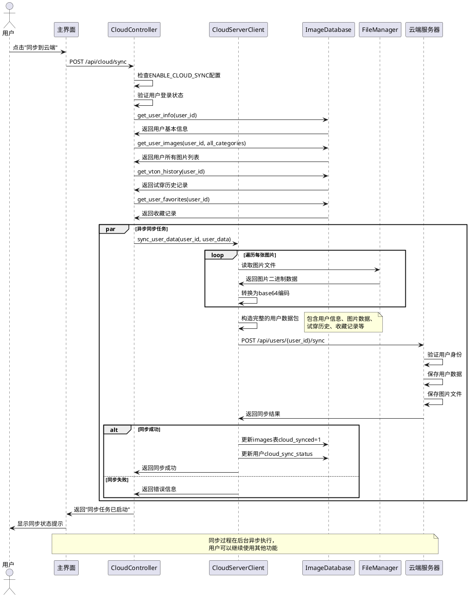
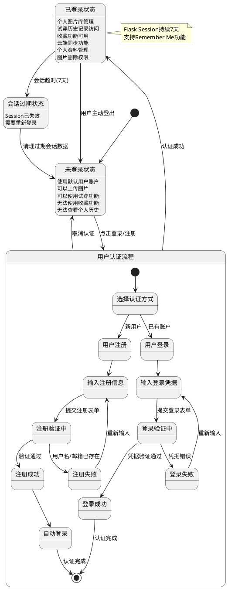
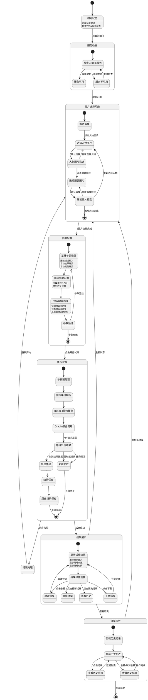
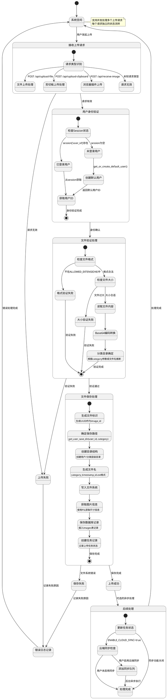

# 基于IDM-VTON虚拟试穿框架的软件工程大作业 - 系统建模报告

项目负责人：熊彦钧、罗斯、李锐钊、吴深荣

## 1. 系统概述

我们的软件是一个基于IDM-VTON的虚拟试穿Web应用，通过Flask后端和Bootstrap前端构建。系统支持用户上传服装和人物图片，调用Gradio虚拟试穿服务生成试穿效果，并提供完整的图片管理、用户认证和数据同步功能。

### 1.1 主要功能

- **浏览器插件：** 将浏览器网页网站的图片发送到本地数据库；
- **用户认证系统**:  负责用户的注册、登录、权限管理；
- **图片管理系统**: 管理用户上传的图片、收藏的试穿结果、以及和云端的同步状态；
- **虚拟试穿系统**: IDM-VTON模型调用、参数配置、结果展示；
- **历史记录**: 试穿历史查看、参数记录、结果回溯；
- **云端同步**: 可以将本地的数据同步到云端服务器，支持用户在不同的主机上登录和同步数据；
- **响应式界面**: Bootstrap 5 + 原生JavaScript构建的现代化Web界面。

### 1.2 技术架构

- **后端框架**: Flask (Python 3.x)；
- **前端技术**: Bootstrap 5.x + 原生JavaScript + Jinja2模板；
- **数据库**: SQLite 3 (支持事务和外键约束)；
- **图片处理**: PIL/Pillow (图片格式转换、尺寸获取)；
- **虚拟试穿**: IDM-VTON + Gradio Client API；
- **通信协议**: RESTful HTTP API + JSON数据格式；
- **文件存储**: 分层文件系统（用户/分类/文件三级目录结构）；
- **会话管理**: Flask Session + Secret Key加密。

---

## 2. 用例图 (Use Case Diagram)

---

## 3. 类图 (Class Diagram)

---

## 4. 序列图 (Sequence Diagram)

### 4.1 用户登录序列图

### 4.2 图片上传序列图

### 4.3 虚拟试穿序列图

### 4.4 云端同步序列图

---

## 5. 状态图 (State Diagram)

### 5.1 用户会话状态图

### 5.2 虚拟试穿状态图

### 5.3 文件管理状态图

---
